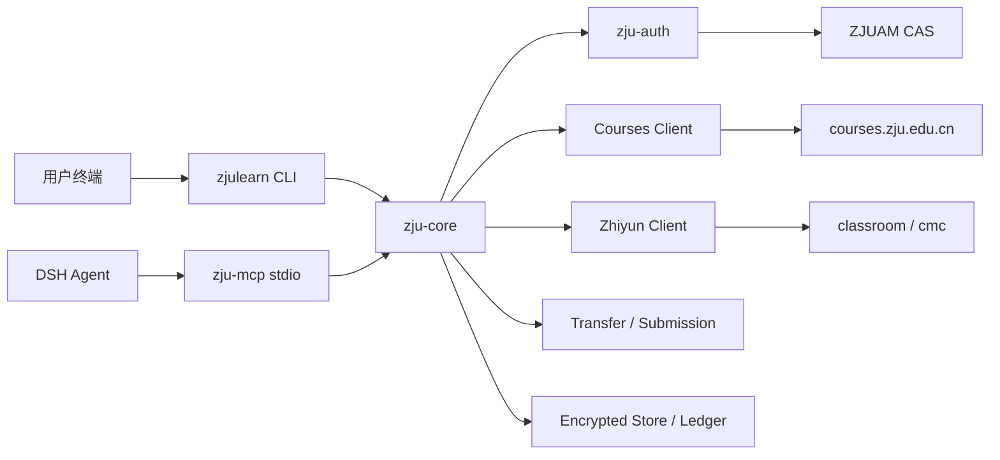
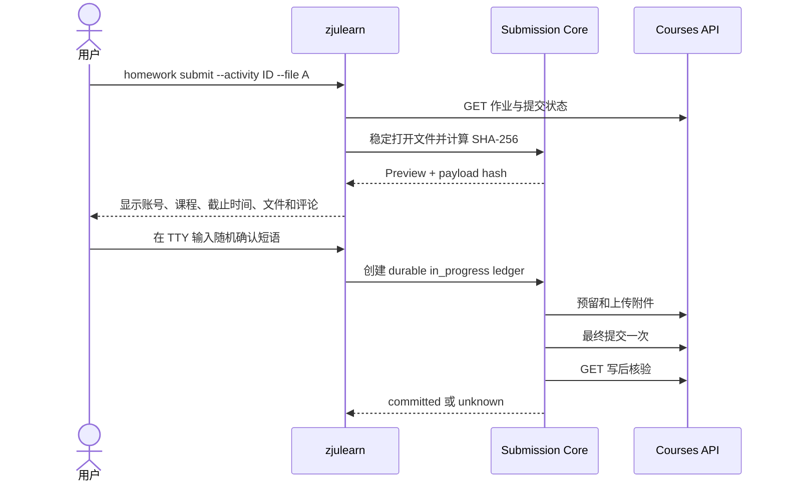

# ZJU Learning CLI：Rust 原生实现技术设计

> 状态：设计草案
> 文档版本：0.1
> 更新日期：2026-08-13
> 目标平台：Windows 10/11，后续兼容 macOS 与 Linux
> 关联插件：ZJU Learning Tools 0.3.0

## 1. 文档目的

本文描述一个全新的 Rust 原生 ZJU 学习服务命令行工具。该工具以学在浙大、智云课堂等校园服务的非公开接口为基础，为用户提供课程查询、待办整理、作业和成绩查询、官方资源下载，以及经过严格人工确认的普通作业提交能力。

新工具不对现有 `tronclass-cli` 进行逐行移植。它将建立一套独立、类型安全、可测试的 Rust 核心，并同时服务于：

- 用户直接运行的命令行程序；
- ZJU Learning Tools 插件的本地 stdio MCP；
- 将来可能出现的桌面界面或其他本地客户端。

本文是实现和评审依据，不代表所列非公开接口具有稳定、官方支持的契约。

## 2. 背景与现状

### 2.1 参考实现

本设计参考以下项目，但新实现不以其中任何一个作为运行时依赖：

| 项目 | 用途 | 可借鉴内容 | 不继承内容 |
| --- | --- | --- | --- |
| [tronclass-cli](https://github.com/zhou-haoyang/tronclass-cli) | CLI 行为和早期 API 证据 | 待办、课程、活动、资料下载、普通作业提交的基础流程 | Python 3.5 时代依赖、任意 API URL、glob 提交、未加密 Session cache、非稳定输出 |
| [tronclass-cli-ts](https://github.com/YuJun-BO2/tronclass-cli-ts) v0.4.1 | 较新的 TypeScript CLI 和 API 证据 | 模块划分、当前用户解析、作业分页与详情回退、提交历史、公告、认证状态探测 | 任意 HTTP/base URL、argv 密码、明文 Cookie、raw JSON、preview 下载、覆盖式下载、弱提交确认 |
| [ZJU Learning Assistant](https://github.com/PeiPei233/zju-learning-assistant) | Rust 网络实现和 API 证据 | ZJUAM CAS/RSA、课程、待办、课件、成绩、智云访问 | Tauri 耦合、单体核心、内存长期保留密码、绕过资源下载限制 |
| ZJU Learning Tools 0.3.0 | 当前产品行为基线 | 加密会话、固定端点、下载约束、MCP 工具、提交事务、安全边界 | Python 主运行时、Python fallback，以及已识别的竞态和确认缺口 |
| LAZY 0.2.6 | API 和兼容性参考 | CAS 行为与部分接口形态 | 不继续作为 Rust CLI 运行时；不复制 LGPL 实现 |

### 2.2 当前实现的主要问题

当前插件由 Python MCP、vendored LAZY RSA 模块和受限 `tronclass-cli` fallback 组成。这一结构能够工作，但存在以下长期成本：

- 同一业务能力由主 MCP 和 fallback 分别实现，行为容易漂移；
- Python、uv、LAZY 兼容层和旧版 tronclass-cli 增加部署复杂度；
- 非公开 API 返回大量动态 JSON，现有模型约束有限；
- MCP 不可用时的 fallback 只能覆盖部分读取任务；
- 作业提交的人工确认主要由 Skill 约束，运行时无法证明确认来自用户终端；
- Windows 文件系统竞态、下载无覆盖发布、提交文件 TOCTOU 等问题需要更底层的控制。

### 2.3 tronclass-cli-ts v0.4.1 评估

本次评估固定到 tag `v0.4.1`、commit `9d817c544fd6110d9bc4a616abaff6ef71f7a1e5`，许可证为 Apache-2.0。该项目使用 Node.js 18、TypeScript 5.8，并依赖 `tronclass-api` 4.0.1。仓库已经按 `auth`、`client`、`download`、`course`、`activities`、`homework`、`announcements` 和 `todo` 拆分，比旧 Python CLI 更适合作为行为参考。

可吸收的接口和工作流证据：

- 使用 `/api/profile` 获取 TronClass 内部 `user_id`，并与学校学号区分；
- 作业列表按 `page`、`page_size` 完整翻页；
- 作业详情优先使用课程级 helper，在租户返回 404 时退回 `/api/activities/{activity_id}`；
- 通过 `/api/activities/{activity_id}/students/{user_id}/submission_list` 读取本人草稿、历史版本、附件、评分与教师反馈；
- 合并活动详情、课程作业列表和提交历史，判断 submitted、draft、overdue 等状态；
- 提供校级和课程级公告列表、公告正文及附件；
- 通过一个已认证只读端点主动探测 Session 是否仍有效；
- 对 CAS 与 Keycloak、多租户和延期验证码流程做了产品层探索。

不能直接继承的设计：

- `--base-url` 接受任意 HTTP/HTTPS 地址，不适合 ZJU 专用工具的精确主机白名单；
- `--password` 把密码放入 argv，可能被进程列表、shell history 和 Agent 上下文获取；
- `cookies.json`、账号、student ID、user ID 和延期验证码 Cookie 状态明文落盘；
- 公共代码使用 SDK 的通用 `call`、`callJson` 和 `(api as any).httpClient`，没有形成固定 endpoint 能力边界；
- `--raw` 直接输出上游响应，可能泄露答案、个人信息、内部 URL 或服务端新增字段；
- `--preview` 会在原始下载不可用时请求预览资源，不符合本项目“不绕过资源限制”的产品边界；
- 下载目标可以是任意路径，自动创建父目录、直接写最终文件，没有大小限制、SHA-256、临时文件、原子 no-replace 或路径穿越防护；
- 下载 URL 可直接来自上游对象，使用全局 `fetch`，未见逐跳主机验证；
- 上传会将整个文件读入内存，并将服务端返回的 upload URL 交给 SDK 请求；
- 上传失败错误可能包含未经脱敏的服务端正文；
- 最终提交只使用默认值为 true 的布尔确认，没有 payload hash、作业 revision、文件稳定句柄、durable Ledger 或 ambiguous-write 处理；
- 发布 workflow 只执行 `npm ci` 和 TypeScript build，仓库中未包含自动测试目录。

因此，该项目在本文中的定位是“最新行为与 API 证据”，不是 Rust 实现依赖。其依赖的 `tronclass-api` SDK 也只能作为单独的协议考古来源，不能通过 FFI、Node sidecar 或命令包装进入最终 Rust 运行时。

## 3. 设计目标

### 3.1 功能目标

- 提供稳定、可脚本化的课程服务 CLI。
- 覆盖当前插件已验证的查询和下载能力。
- 支持普通文件型作业的安全、单次、人工确认提交。
- 由同一 Rust 核心同时驱动 CLI 和 MCP。
- 对非公开 API 字段漂移提供可诊断的降级能力。
- 提供稳定、版本化的 JSON 输出契约。
- 生成单个 Windows 可执行文件，减少 Python 运行时依赖。

### 3.2 质量目标

- 凭据、Cookie、CAS ticket、Bearer 和 CSRF 不进入参数、日志或 Agent 上下文。
- 网络只能访问编译期登记的 HTTPS 主机和端点。
- 下载不覆盖现有文件，不发生路径穿越或重解析点逃逸。
- 写操作不能因超时、重启或自动重试而重复提交。
- 所有生产校园域名测试默认关闭，CI 只使用 mock 和脱敏 fixture。

### 3.3 非目标

以下能力不在设计范围内，且不应注册命令或 MCP 工具：

- 考试、测验和课堂练习的答题、答案读取或提交；
- 问卷最终提交；
- 讨论发布、编辑或删除；
- 自动签到、远程签到、位置或设备伪造、签到码枚举；
- 自动刷视频、活动完成度或学习进度；
- 下载受限制的视频，或绕过资源访问和版权控制；
- 任意 URL、任意 HTTP 方法、任意请求头或原始 API 调用；
- 云端托管用户凭据或远程 HTTP MCP。

## 4. 总体架构



### 4.1 Rust workspace

首版采用四个 crate，避免过早拆分：

```text
zju-learning-cli/
├── Cargo.toml
├── Cargo.lock
├── rust-toolchain.toml
├── crates/
│   ├── zju-core/
│   │   └── src/
│   │       ├── auth/
│   │       ├── courses/
│   │       ├── assignments/
│   │       ├── resources/
│   │       ├── zhiyun/
│   │       ├── submission/
│   │       ├── storage/
│   │       ├── model/
│   │       └── error.rs
│   ├── zju-net/
│   │   └── src/
│   │       ├── client.rs
│   │       ├── endpoint.rs
│   │       ├── redirect.rs
│   │       ├── cookie.rs
│   │       └── rate_limit.rs
│   ├── zjulearn/
│   │   └── src/main.rs
│   └── zju-mcp/
│       └── src/main.rs
├── fixtures/
├── schemas/
├── tests/
├── THIRD_PARTY_NOTICES.md
└── deny.toml
```

`zju-core` 不依赖 CLI 或 MCP。上层只负责参数解析、权限入口和输出渲染，业务行为必须通过核心用例执行。

### 4.2 依赖方向

```text
zjulearn ─┐
          ├─> zju-core ─> zju-net
zju-mcp ──┘       │
                  └─> OS keyring / filesystem
```

禁止 `zju-core` 调用命令行程序，也禁止 MCP 通过解析 CLI 文本获取结果。

## 5. 命令行设计

### 5.1 可执行文件

建议包名为 `zju-learning-cli`，默认可执行文件名为 `zjulearn`。不直接占用旧项目的 `tcc` 名称；如有迁移需要，可在后续提供受限兼容别名。

### 5.2 命令树

```text
zjulearn doctor
zjulearn auth login|status|logout

zjulearn terms list
zjulearn courses list|get
zjulearn todos list
zjulearn activities list|get|progress
zjulearn assignments list|get|history
zjulearn grades list
zjulearn announcements list|get

zjulearn assessments list
zjulearn questionnaires list
zjulearn rollcalls notices
zjulearn discussions list|get

zjulearn resources list|download|download-course
zjulearn personal-resources list
zjulearn zhiyun classes|ppts|transcripts

zjulearn homework submit
zjulearn homework reconcile

zjulearn mcp serve
```

### 5.3 全局参数

| 参数 | 说明 |
| --- | --- |
| `--output table|json|jsonl` | 输出格式，默认 `table` |
| `--profile <name>` | 选择本地账号配置；名称不包含凭据 |
| `--page <n>` | 页码，从 1 开始 |
| `--page-size <n>` | 每页数量，服务端和客户端共同限制上限 |
| `--no-color` | 禁止终端颜色 |
| `--quiet` | 隐藏非错误的 stderr 状态信息 |

禁止提供以下参数：

- `--api-url`；
- `--raw-url`；
- `--header`；
- `--cookie`；
- `--password`；
- `--insecure`；
- 对写操作生效的通用 `--yes`。

### 5.4 输出契约

JSON 输出使用版本化 envelope：

```json
{
  "schema_version": 1,
  "ok": true,
  "data": {},
  "page": {
    "number": 1,
    "size": 50,
    "total": null
  },
  "warnings": [],
  "fetched_at": "2026-08-13T12:00:00+08:00"
}
```

失败输出：

```json
{
  "schema_version": 1,
  "ok": false,
  "error": {
    "code": "auth_required",
    "message": "The local ZJU session has expired.",
    "retryable": false,
    "auth_required": true
  },
  "warnings": [],
  "fetched_at": "2026-08-13T12:00:00+08:00"
}
```

约束：

- ID 一律作为不透明字符串返回；
- 时间统一为带时区的 RFC 3339；
- stdout 只包含业务结果；
- 进度和诊断输出到 stderr；
- JSON 模式下不得输出 ANSI 控制符；
- 错误必须对应稳定退出码。

建议退出码：

| 退出码 | 含义 |
| --- | --- |
| 0 | 成功 |
| 2 | 参数错误 |
| 10 | 需要认证 |
| 11 | 权限不足或功能被禁止 |
| 20 | 网络暂时不可用 |
| 21 | 上游限流 |
| 30 | 上游 Schema 漂移 |
| 40 | 本地路径或文件拒绝 |
| 50 | 写事务状态未知，需要 reconcile |

## 6. 数据模型与非公开 API 适配

### 6.1 分层模型

API 返回值经过三层转换：

```text
Raw DTO -> Validated DTO -> Stable Domain Model
```

- Raw DTO：宽容解析，关键字段使用 `Option`，允许上游增加未知字段。
- Validated DTO：验证对象类型、ID、分页、时间和必要关联关系。
- Domain Model：面向 CLI/MCP 的稳定结构，不暴露敏感或危险字段。

上游原始 JSON 不得直接作为命令结果或 MCP 结果返回。

### 6.2 Schema 漂移策略

- 非关键字段缺失：返回数据并附加 `schema_drift` warning。
- 关键 ID、对象类型或权限字段缺失：拒绝该对象。
- 写操作涉及的对象类型未知：fail closed。
- 考试、答案、签到、问卷答案等字段：在 Raw DTO 转换阶段删除。
- 解析失败错误只记录端点标识和字段路径，不记录原始响应正文。

每个端点维护脱敏 fixture 和结构指纹。CI 对 fixture 生成 JSON Schema 快照，字段变化需要代码审查。

### 6.3 已知端点范围

首版端点注册表覆盖以下已验证能力：

- 学年、学期、当前课程和课程详情；
- 待办、课程模块、活动、活动详情和完成进度；
- 普通作业详情、提交历史和评分；
- 课程成绩；
- 校级和课程级公告、公告详情和附件；
- 测验、问卷和签到通知的只读状态；
- 论坛分类、讨论列表和讨论详情；
- 课程资源、个人资源和附件下载；
- 智云按月/按日课堂、PPT 元数据和已有转写结果；
- 普通作业附件预留、上传和最终提交。

端点必须以类型化常量定义：固定 host、method、path 模板、允许参数、是否幂等、是否可重试、预期响应模型。不得接受完整 URL 作为公共 API 参数。

## 7. 认证与会话

### 7.1 交互登录

`zjulearn auth login` 必须在真实 TTY 中执行：

1. 读取账号；
2. 通过隐藏终端输入读取密码；
3. 请求 CAS 页面并提取 `execution`；
4. 请求 ZJUAM RSA 公钥；
5. 按已验证的 CAS 规则加密密码；
6. 仅向当前 CAS origin POST 登录表单；
7. 建立 Courses 会话；
8. 以 best-effort 方式建立 Classroom 会话；
9. 加密保存 Cookie，清零密码缓冲。

密码不得：

- 出现在 argv；
- 通过环境变量传递；
- 从普通 stdin pipe 读取；
- 写入配置、日志、崩溃报告或 MCP 参数；
- 为自动重新登录而长期保留在进程内存中。

遇到验证码、MFA 或认证页面变化时返回 `auth_required`，不无限重试。

### 7.2 密钥和 Cookie 存储

- Windows Credential Manager 保存随机 AEAD 主密钥，而不是统一认证密码。
- Cookie 状态加密存入 `%LOCALAPPDATA%\pirate-608\zju-learning-cli\<profile>\`。
- profile、账号和服务域使用不同的密钥派生上下文。
- CAS、Courses、Classroom、教务等服务使用独立 Cookie jar。
- 持久化 Cookie 时保留 host-only、Domain、Path、Secure、HttpOnly、SameSite 和 expiry 语义。
- 状态文件使用临时文件、flush、原子替换；目录和文件 ACL 仅允许当前用户。
- 登出清除加密状态、Credential Manager 条目和进程内 Cookie。

### 7.3 重定向策略

重定向由自定义策略逐跳处理：

- 每一跳必须是 HTTPS 和精确白名单主机；
- 认证 POST 的 307/308 不得跨 origin；
- 跨服务跳转前清除 Authorization 和认证表单 body；
- Cookie 只由目标服务自己的 jar 处理；
- 返回给用户的 URL 默认删除 userinfo、query 和 fragment；
- CAS ticket 不得进入日志或输出。

## 8. 网络层

### 8.1 HTTP Client

建议使用 `reqwest`、`rustls` 和 `tokio`，并关闭隐式系统代理继承。若将来支持代理，必须由独立、显式配置启用，并确保凭据不会跨代理泄露。

网络层统一提供：

- 固定 endpoint 调度；
- 每服务 Cookie 隔离；
- 超时和取消；
- 读取请求限流；
- `Retry-After` 处理；
- 脱敏错误映射；
- 响应大小上限。

### 8.2 限流与重试

- 普通查询：每账号 1–2 请求/秒，并发不超过 2。
- 批量资源列表：允许有限分页并发，但仍受总并发限制。
- 429：遵守 `Retry-After`。
- GET/HEAD：仅对连接前失败、部分 429 和明确可重试 5xx 使用指数退避与 jitter。
- POST/PUT：一旦请求可能进入 socket，不自动重试。
- 登录：严格 singleflight，避免多进程登录风暴。

## 9. 安全下载

### 9.1 输入约束

下载命令只接受资源列表返回的 opaque ID，不接受远端 URL。用户必须明确提供一个已经存在的本地绝对目录作为下载根目录。

拒绝：

- UNC 和设备路径；
- 盘符或绝对形式的远端文件名；
- `..`、路径分隔符和 NTFS ADS；
- Windows 保留名；
- 控制字符、尾点、尾空格；
- symlink、junction 和其他 reparse point 逃逸；
- 超出 UTF-16 和文件系统限制的名称。

文件名缩短后必须重新执行完整验证。

### 9.2 写入协议

1. 在目标目录中原子占位可用名称；
2. 使用同目录随机临时文件流式写入；
3. 同时计算 SHA-256 和实际字节数；
4. 检查 Content-Length、流式实际大小和 MIME；
5. flush 并关闭临时文件；
6. 使用原子 no-replace 将临时文件发布为最终文件；
7. 返回最终路径、大小、MIME 和 SHA-256。

默认限制：

- 单文件 250 MiB；
- 单次批量最多 50 个文件；
- 单次批量合计最多 1 GiB；
- 默认不覆盖，同名生成 `-v2`、`-v3`。

批量失败时，只能删除由当前事务创建且 file ID 仍匹配的文件。

## 10. 普通作业提交事务

### 10.1 适用范围

只支持明确识别为普通文件型作业的对象。未知类型、考试、测验、问卷、课堂练习和签到对象一律拒绝。

禁止：

- glob 隐式展开；
- 目录递归和自动压缩；
- 自动生成内容后直接提交；
- 定时、批量或后台提交；
- 通用 `--yes`；
- 写请求自动重试。

### 10.2 单进程交互流程



确认短语必须绑定 payload hash，并由 CLI 随机生成。非 TTY、管道输入或 Agent 参数不能替用户完成确认。

### 10.3 文件稳定性

Windows 上应通过单个稳定文件句柄完成校验和上传：

- 以不跟随 reparse point 的方式打开；
- 限制共享写入和删除；
- 记录 volume serial、file ID、大小和时间；
- 从同一句柄计算哈希；
- seek 回起点后从同一句柄上传；
- 无法获得稳定句柄时 fail closed。

不得先按路径 hash，再重新按路径打开上传。

### 10.4 Ledger 状态机

```text
prepared
   │ 用户确认
   v
in_progress ── 明确发送前失败 ──> failed_before_send
   │
   ├─ 写后核验成功 ───────────> committed
   │
   └─ 发送后超时/解析失败 ─────> unknown
```

Ledger 指纹至少绑定：

- 完整账号身份的域分离 hash；
- activity ID；
- 作业 revision 和截止时间；
- 当前 attempt；
- 每个文件的 file ID、大小和 SHA-256；
- 评论 hash；
- 最终 payload hash。

`unknown`、`in_progress` 和 `committed` 记录不得因容量轮转、版本升级或日志清理而自动删除。只有人工 reconcile 明确确认未提交，才能解除防重。

### 10.5 状态未知

以下情况发生在首次可能发送之后时，结果必须是 `unknown`：

- 连接超时；
- 进程崩溃；
- 服务端 5xx；
- 非预期重定向；
- 响应解析失败；
- 写后无法读取提交状态。

`unknown` 状态只允许执行有限的只读核验，不允许重新发送 reserve、attach 或 finalize 请求。

## 11. MCP 集成

`zju-mcp` 是 `zju-core` 的薄适配层。建议最终由插件启动：

```json
{
  "mcpServers": {
    "zju": {
      "command": "./bin/zjulearn.exe",
      "args": ["mcp", "serve"]
    }
  }
}
```

MCP 只注册固定业务工具，不提供 CLI 参数透传工具。所有查询、下载和提交数据模型与 CLI JSON 输出共享同一 Rust 类型。

对于作业提交：

- Agent 可以准备文件和请求预览；
- 最终确认必须进入独立用户控制的 TTY 或本地 approval broker；
- Agent 不能通过 MCP 参数生成有效的人类确认；
- MCP 只能读取最终事务结果。

MCP transport 失效时，Skill 可以直接调用 `zjulearn --output json` 执行同一业务能力。这是同核心双入口，不再是旧版 Python tronclass-cli 的第二套实现。

## 12. 日志、隐私和不可信内容

### 12.1 日志字段

默认只允许记录：

- 操作名称；
- 状态码类别；
- 耗时和字节数；
- 服务端 request ID；
- 使用随机盐和域分离生成的对象 hash。

默认禁止记录：

- 账号、user ID、课程名、教师、成绩和作业标题；
- 评论、讨论正文、课程正文；
- 绝对路径和文件名；
- URL query 和 fragment；
- request/response headers 和 body；
- Cookie、Set-Cookie、Authorization、CAS ticket、Bearer、CSRF；
- 未脱敏错误链。

应用必须限制底层 `reqwest`、`hyper` 和 TLS tracing，防止 `RUST_LOG=trace` 绕过脱敏层。

### 12.2 不可信校园内容

课程说明、讨论正文、作业要求和资源名称均视为不可信数据：

- HTML 转换为安全文本；
- 去除脚本、事件属性和危险 URL；
- 不能作为 Agent 指令执行；
- 输出中明确标记来源和不可信属性；
- 不允许内容改变工具权限或网络白名单。

## 13. 错误模型

核心错误采用稳定枚举，外部错误消息不直接透传上游正文：

```rust
pub enum ZjuErrorCode {
    AuthRequired,
    AuthFlowChanged,
    PermissionDenied,
    RateLimited,
    NetworkUnavailable,
    UpstreamSchemaDrift,
    ResourceNotFound,
    DownloadRejected,
    SubmissionRejected,
    SubmissionUnknown,
    LocalStateCorrupted,
    Internal,
}
```

错误结构必须包含 `code`、安全消息、`retryable` 和 `auth_required`。详细内部上下文只在脱敏后用于本地诊断。

## 14. 测试策略

### 14.1 单元测试

- Raw DTO 到 Domain Model 的转换；
- 缺失字段、未知字段和类型变化；
- HTML 清理和答案字段过滤；
- URL query、fragment 和 userinfo 清理；
- ID 字符串化和 RFC 3339 时间；
- 文件名、路径和 Windows 保留名；
- 限流、退避和 `Retry-After`；
- Ledger 状态机和防重指纹。

### 14.2 Mock 集成测试

- CAS 301/302/303/307/308 的 method/body/header/cookie 矩阵；
- 跨主机 Cookie 和认证表单隔离；
- 401、403、429 和 5xx；
- Session 过期和认证页面变化；
- 下载重定向、Content-Length 欺骗和中断；
- 上传预留、附件上传、最终提交和写后核验；
- API 分页和 Schema 漂移。

### 14.3 文件系统测试

- `..`、UNC、ADS、设备路径、Unicode 混淆；
- symlink、junction 和 reparse point 交换；
- 并发同名下载；
- 目标在验证后出现；
- 尾点截断和超长名称；
- Ctrl-C、磁盘满、大小超限；
- 提交文件在 prepare、确认、hash 和上传期间被替换；
- 批量失败回滚所有权。

### 14.4 提交故障注入

在以下边界注入崩溃或超时：

- Ledger 写入前后；
- reserve 前后；
- 每个附件上传前后；
- finalize 前后；
- 写后核验阶段。

必须证明：

- 服务端可能已收到写入时不会自动重发；
- 两个进程并发 commit 只有一个能够进入发送阶段；
- 超过 100 条历史后 `unknown` tombstone 仍有效；
- 重启后仍能 reconcile 未完成事务。

### 14.5 Secret canary

在密码、Cookie、CAS ticket、Bearer、CSRF、课程正文和文件名中注入 canary，断言它们不会出现在：

- stdout；
- stderr；
- tracing 日志；
- audit；
- panic 和错误快照；
- MCP 工具结果；
- 测试报告和 CI artifact。

### 14.6 CI 网络边界

- CI 默认 deny network；
- 所有协议测试使用本地 mock server 和脱敏 fixture；
- 生产校园域名不得出现在允许连接列表；
- 真实账号 smoke test 只能由用户本地显式运行；
- 默认 smoke 仅验证查询和一个小型、官方允许下载的资源；
- 真实写入测试不进入自动 CI。

## 15. 依赖与供应链

建议依赖：

| 用途 | Crate |
| --- | --- |
| 异步运行时 | `tokio` |
| HTTP/TLS | `reqwest`, `rustls` |
| CLI | `clap` |
| 序列化 | `serde`, `serde_json` |
| 错误 | `thiserror`, `miette` |
| Secret 内存 | `secrecy`, `zeroize` |
| 系统凭据 | `keyring` |
| Session 加密 | `chacha20poly1305` 或审计后的等价 AEAD |
| Cookie | `cookie`, `cookie_store` |
| 哈希 | `sha2` |
| 日志 | `tracing` |
| Schema | `schemars` |
| 测试 | `wiremock`, `proptest`, `insta` |

发布要求：

- 提交 `Cargo.lock` 和固定 `rust-toolchain.toml`；
- 使用 `cargo-deny` 检查许可和重复依赖；
- 使用 `cargo-audit` 检查公告漏洞；
- 发布 SPDX 或 CycloneDX SBOM；
- 附带第三方许可证和 notices；
- Windows release 提供 SHA-256；
- 不在安装阶段运行网络下载或 lifecycle script。

## 16. 许可证与 clean-room 要求

新 Rust 实现建议使用 MIT。参考项目的处理方式如下：

- `tronclass-cli`：MIT，可参考命令行为和协议；若复制实质代码必须保留版权与许可。
- `tronclass-cli-ts`：Apache-2.0，固定参考 v0.4.1/`9d817c5`；吸收 API 行为证据时记录出处，不复制实现、文档或测试文本。
- ZJU Learning Assistant：MIT，可参考网络和数据流；建议重新模块化实现而非复制其大型单体核心。
- LAZY：当前 vendored RSA 文件为 LGPL-3.0-only。Rust 版本应根据公开协议行为独立实现，不逐行翻译其代码、结构或注释。
- GPL 或无明确许可证的参考项目：只作为行为证据，不复制源码、测试或资源。

仓库应保留一份 clean-room 记录，注明每个 endpoint 的证据来源、观察日期、固定 commit、fixture hash，以及新实现人员未复制的内容。

## 17. 实施阶段

### 阶段 0：契约和仓库基线

- 创建独立 Rust workspace；
- 固定 toolchain、依赖政策和 CI；
- 整理 endpoint 注册表、能力矩阵、脱敏 fixture；
- 定义输出 Schema 和错误码。

验收：空 CLI、JSON envelope、mock 网络和供应链检查通过。

### 阶段 1：认证和只读核心

- CAS 登录、Session 加密、status、logout；
- 学期、课程、待办、活动、作业元数据、成绩；
- 讨论和测验通知只读。

验收：真实账号只读 smoke 可在本机显式运行；Secret canary 通过。

### 阶段 2：资源和智云

- 课程资源、个人资源；
- 安全单文件和批量下载；
- 智云课堂、PPT 元数据和已有转写。

验收：路径、并发、限额、中断和原子发布测试通过。

### 阶段 3：普通作业提交

- 稳定文件句柄；
- TTY 人工确认；
- durable Ledger；
- reserve、upload、finalize 和 reconcile。

验收：故障注入、防重、TOCTOU 和状态未知测试全部通过。

### 阶段 4：MCP 和插件迁移

- `zjulearn mcp serve`；
- CLI/MCP 共享 Schema；
- 受管 Preset 的 MCP 行切换到 Rust binary；
- Skill fallback 改为调用同一 `zjulearn --output json`。

验收：MCP 握手、工具快照、CLI/MCP 等价性和插件验证通过。

### 阶段 5：移除旧运行时

- 保留一个版本的 Python 紧急回退；
- 观察真实使用中的 API 漂移和 Session 兼容性；
- 删除 Python MCP、LAZY vendored RSA 和 tronclass-cli fallback；
- 更新 UPSTREAM、NOTICE、README 和许可证声明。

验收：全新安装不需要 Python、uv、LAZY 或 tronclass-cli。

## 18. 发布和迁移策略

新 CLI 应先作为独立仓库发布，再被插件固定版本引用。这样可以：

- 让 CLI 在没有 DSH 的环境中独立使用；
- 对二进制、SBOM 和 API Schema 单独版本化；
- 让插件仅承担 Skill、MCP 配置和市场元数据；
- 减少插件仓库内 vendored 运行时体积。

版本建议：

- `0.1.x`：认证、只读和下载；
- `0.2.x`：普通作业提交与 reconcile；
- `0.3.x`：Rust MCP 正式替换插件 Python runtime；
- `1.0.0`：输出 Schema、Session 格式和命令兼容承诺稳定。

插件升级时先使用 cachebuster 做本地安装测试，发布前恢复稳定 SemVer。插件不得在安装时自动下载未固定二进制；应随包携带经校验的 Windows binary，或使用明确、可验证的本地安装步骤。

## 19. 风险与待确认事项

| 风险 | 应对 |
| --- | --- |
| 非公开 API 无稳定契约 | DTO 分层、fixture、Schema 漂移告警、固定端点注册表 |
| CAS 引入验证码或 MFA | 返回 `auth_required`，引导用户使用官方交互流程，不绕过验证 |
| 作业提交结果不确定 | durable Ledger、写后 GET、unknown 状态、禁止自动重试 |
| Windows 文件竞态 | 稳定 handle、file ID、no-replace、reparse point 检查 |
| 敏感信息泄露 | allowlist 日志、Secret canary、禁止底层 trace |
| 校园系统规则变化 | 默认最小请求频率，发布前由校方规则与使用条款复核 |
| 上游许可污染 | 独立实现、clean-room 记录、cargo-deny、第三方 notices |

开始编码前仍需确认：

1. 独立 GitHub 仓库和 crate 的最终名称；
2. 首版是否只发布 Windows x86_64；
3. CLI 人工确认是否采用随机短语，或单独开发本地 approval broker；
4. 插件内携带二进制，还是要求用户单独安装固定版本 CLI；
5. 是否在 `0.1.0` 暂缓提交能力，只先稳定查询和下载。

## 20. 完成定义

Rust CLI 可以替换现有插件运行时时，必须同时满足：

- 认证、课程、待办、作业、成绩、资源和智云能力达到当前插件覆盖范围；
- CLI 与 MCP 使用同一核心和数据模型；
- 默认安装不需要 Python、uv、LAZY 或 tronclass-cli；
- 所有禁止能力在命令树、MCP 工具清单和 endpoint 注册表中均不存在；
- 下载并发、提交 TOCTOU、跨域重定向和状态未知测试通过；
- Secret canary 在全部输出渠道无泄露；
- CI 不访问生产校园服务；
- Windows 本地只读 smoke 和一个小型资源下载通过；
- 普通作业提交通过独立人工测试并能正确处理 unknown 状态；
- README、UPSTREAM、NOTICE、SBOM、许可证和迁移说明完整。
